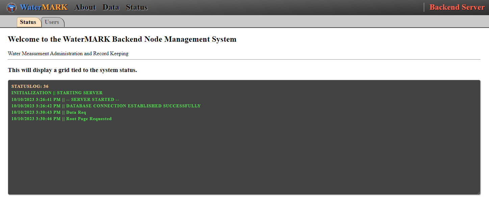

# WaterMARK - BACKEND

## _Water Measurment Administration & Record Keeping - Backend Server_

___

### Information

Water Measurment Administration & Record Keeping => WaterMARK  
WaterMARK is a multi-source meter data aggregation, scheduling, task managemet and water order processing application.

This backend system is designed to work with [WaterMARK](https://github.com/mikelambson/WaterMARK) as the primary frontend system. The pages generated by this system are intended to be used by IT staff to manage and update data ingestion sources.

___

Example showing dev layout of backend screen:

___

### API Method

API pattern:
`/api/dataSource?find:column=parameter>parameterRangeIndicator&find:anothercolumn=x,y,z`

We begin the route query with the `?find:` operator followed by the initial query parameter which is generally a column ref `=` a value.  This is extended when we add incorporate the data aspect into the lookup to allow for a singular date or a range via the `>` key.

These `find:column=value` methods can be chained via `&`.
For multiple values from the same column we can separate using `,`.
